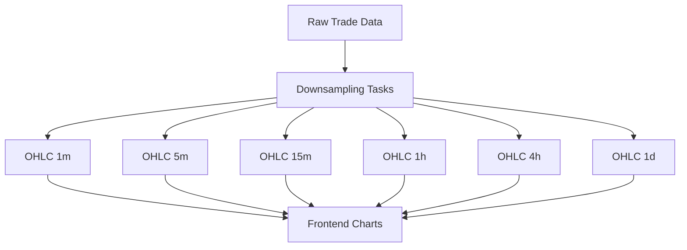
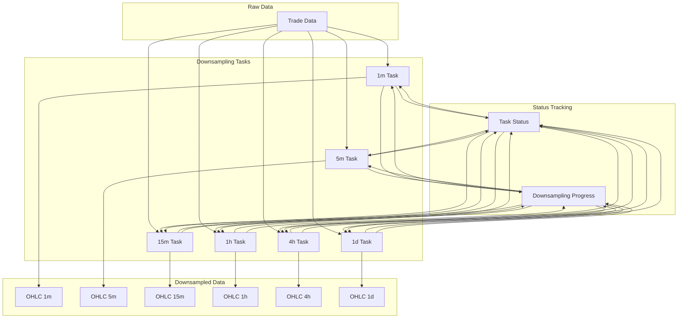
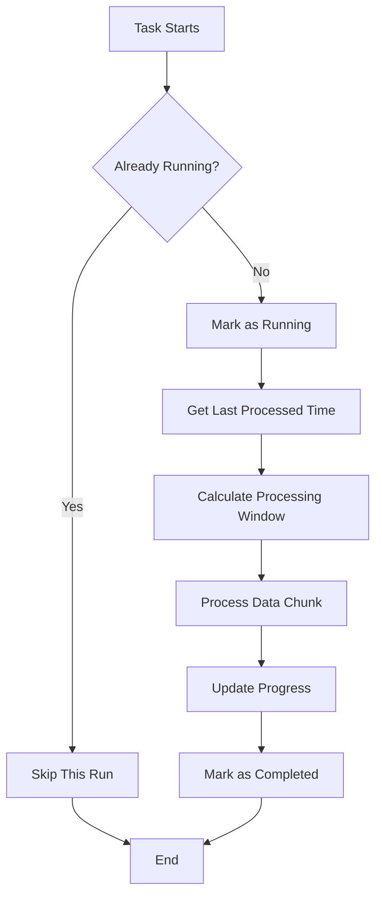
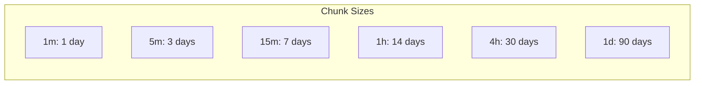
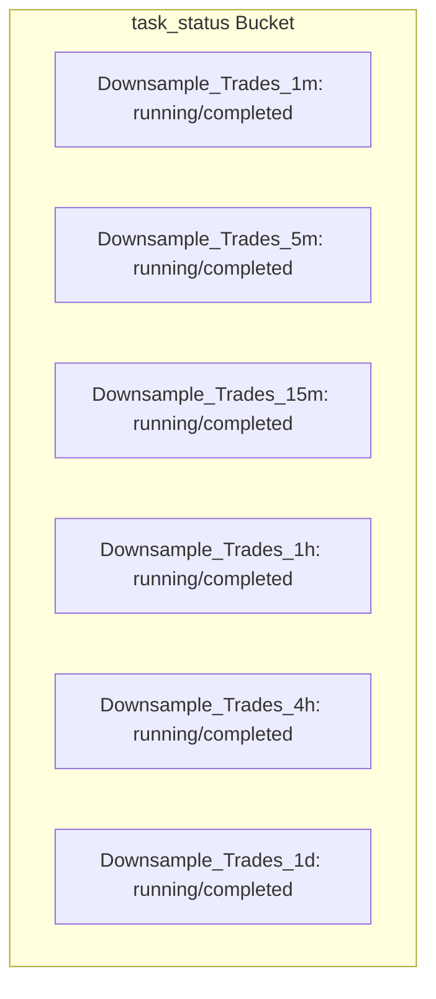
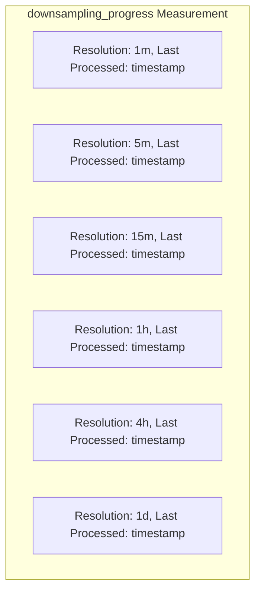

# Downsampling System Documentation

This document provides detailed information about the downsampling system used in the TradingView InfluxDB POC. The system is designed to efficiently process large volumes of trade data into pre-aggregated OHLC (Open, High, Low, Close) data at multiple resolutions.

## Overview

The downsampling system uses InfluxDB's task mechanism to process raw trade data into OHLC candles at various time resolutions. This approach significantly improves query performance for chart rendering, especially for higher time resolutions and larger date ranges.



## Key Features

1. **Incremental Processing**: Tasks process data in chunks, tracking progress to avoid reprocessing already downsampled data.
2. **Multiple Resolutions**: Supports various time resolutions (1m, 5m, 15m, 1h, 4h, 1d).
3. **Task Overlap Prevention**: Ensures only one instance of each task runs at a time.
4. **Chunk-Based Processing**: Optimizes memory usage by processing data in time-based chunks.
5. **Progress Tracking**: Maintains a record of the last processed timestamp for each resolution.
6. **Automatic Resolution Selection**: Frontend automatically selects the appropriate resolution based on the requested date range.

## Supported Resolutions

The system supports the following resolutions:

| Resolution | Description | Chunk Size | Measurement Name |
|------------|-------------|------------|------------------|
| 1m         | 1 minute    | 1 day      | trade_ohlc_1m    |
| 5m         | 5 minutes   | 3 days     | trade_ohlc_5m    |
| 15m        | 15 minutes  | 7 days     | trade_ohlc_15m   |
| 1h         | 1 hour      | 14 days    | trade_ohlc_1h    |
| 4h         | 4 hours     | 30 days    | trade_ohlc_4h    |
| 1d         | 1 day       | 90 days    | trade_ohlc_1d    |

## Resolution Mapping

The system maps user-requested resolutions to available downsampled data to optimize storage while providing accurate visualization:

| Requested Resolution | Used Downsampled Resolution |
|----------------------|-----------------------------|
| 1m                   | 1m                          |
| 5m                   | 5m                          |
| 15m                  | 15m                         |
| 30m                  | 15m                         |
| 1h                   | 1h                          |
| 2h                   | 1h                          |
| 4h                   | 4h                          |
| 6h                   | 4h                          |
| 12h                  | 4h                          |
| 1d                   | 1d                          |

Additionally, for very large date ranges, the system automatically selects a larger resolution to improve performance:

- Date range > 365 days: Force 1d resolution
- Date range > 90 days: Force 1h resolution for smaller requests
- Date range > 30 days: Force 15m resolution for 1m requests

## System Architecture

### Data Flow



### Components

1. **Raw Trade Data**: Stored in the main bucket with measurement name `trade`.
2. **Downsampling Tasks**: InfluxDB tasks that process raw data into OHLC candles.
3. **Downsampled Data**: Stored in the main bucket with measurement names like `trade_ohlc_1m`.
4. **Task Status**: Stored in a separate `task_status` bucket to prevent overlapping runs.
5. **Downsampling Progress**: Stored in the main bucket with measurement name `downsampling_progress`.

## Incremental Processing

Each downsampling task follows this workflow:



1. **Check Status**: The task first checks if it's already running by querying the `task_status` bucket.
2. **Mark as Running**: If not running, the task marks itself as running in the `task_status` bucket.
3. **Get Last Processed Time**: The task queries the `downsampling_progress` measurement to find the last processed timestamp.
4. **Calculate Processing Window**: The task calculates the time window to process based on the last processed timestamp and the chunk size.
5. **Process Data**: The task processes the raw trade data within the calculated time window, generating OHLC candles.
6. **Update Progress**: The task updates the `downsampling_progress` measurement with the new last processed timestamp.
7. **Mark as Completed**: The task marks itself as completed in the `task_status` bucket.

## Chunk-Based Processing

Each resolution has a specific chunk size to optimize memory usage and processing time:



The chunk size is chosen based on the expected number of data points for each resolution. Higher resolutions (smaller time intervals) use smaller chunk sizes because they generate more data points per unit of time.

## Task Status Tracking

The system uses a separate `task_status` bucket to track the status of each task:



Each task has a status record with two possible values:
- `running`: The task is currently processing data.
- `completed`: The task has finished processing its current chunk.

This mechanism prevents multiple instances of the same task from running simultaneously, which could lead to duplicate data or resource contention.

## Progress Tracking

The system tracks the progress of each downsampling task using the `downsampling_progress` measurement:



Each record contains:
- `resolution`: The resolution being processed.
- `last_processed`: The timestamp of the last processed data.

This allows tasks to resume from where they left off, even if they were interrupted or failed.

## OHLC Data Structure

The downsampled OHLC data is stored in measurements named `trade_ohlc_{resolution}`:

```
Measurement: trade_ohlc_1m (example for 1m resolution)
Tags:
  - symbol: Trading pair (e.g., BTCUSD)
Fields:
  - open: Opening price
  - high: Highest price
  - low: Lowest price
  - close: Closing price
  - volume: Total volume
Timestamp: Candle start time
```

## Setting Up Downsampling Tasks

The downsampling tasks are created using the `setupDownsamplingTasks.js` script:

```bash
node src/scripts/setupDownsamplingTasks.js
```

This script:
1. Creates the `task_status` bucket if it doesn't exist.
2. Creates or updates the downsampling tasks for each resolution.
3. Creates initial status points for each task.

## Running Downsampling Tasks Manually

You can manually trigger the downsampling tasks using the `runDownsamplingTask.js` script:

```bash
# Run a specific task
node src/scripts/runDownsamplingTask.js Downsample_Trades_1m

# Run all tasks
node src/scripts/runDownsamplingTask.js all

# Force run a task even if it's already running
node src/scripts/runDownsamplingTask.js Downsample_Trades_1m --force
```

## Verifying Downsampling Tasks

You can verify the status of the downsampling tasks using the `verifyDownsamplingTasks.js` script:

```bash
node src/scripts/verifyDownsamplingTasks.js
```

This script:
1. Checks if the tasks exist and are properly configured.
2. Checks the status of each task.
3. Checks the progress of each task.
4. Checks if downsampled data exists for each resolution.
5. Provides a summary of the findings.

## Checking Downsampled Data

You can check the downsampled data using the `checkDownsampledData.js` script:

```bash
node src/scripts/checkDownsampledData.js
```

This script:
1. Counts the number of downsampled data points for each resolution.
2. Checks the time range of the downsampled data.
3. Verifies that the data is properly formatted.

## Task Configuration

Each downsampling task is configured with the following parameters:

```javascript
{
  name: `Downsample_Trades_${resolution.name}`,
  every: resolution.every, // How often the task runs (e.g., '1m')
  flux: createFluxScript(config.bucket, config.statusBucket, resolution)
}
```

The Flux script for each task includes:
1. Code to check if the task is already running.
2. Code to mark the task as running.
3. Code to get the last processed timestamp.
4. Code to calculate the processing window.
5. Code to process the data and generate OHLC candles.
6. Code to update the progress.
7. Code to mark the task as completed.

## Performance Considerations

1. **Chunk Size**: The chunk size for each resolution is carefully chosen to balance memory usage and processing time. Larger chunk sizes process more data at once but require more memory.
2. **Task Frequency**: All tasks run every minute, but the overlap prevention mechanism ensures they only process new data when needed.
3. **Memory Usage**: The system is designed to minimize memory usage by processing data in chunks and using InfluxDB's streaming capabilities.
4. **Query Performance**: Pre-downsampled data significantly improves query performance, especially for higher time resolutions and larger date ranges.

## Troubleshooting

### Task Not Running

If a task is not running, check:
1. If the task exists: `node src/scripts/verifyDownsamplingTasks.js`
2. If the task is marked as running: Check the `task_status` bucket
3. If the task has any errors: Check the InfluxDB task logs

### Missing Downsampled Data

If downsampled data is missing, check:
1. If the task is running: `node src/scripts/verifyDownsamplingTasks.js`
2. If the task has processed any data: Check the `downsampling_progress` measurement
3. If there is raw trade data for the symbol and time range: `node src/scripts/countTrades.js`

### Task Stuck in Running State

If a task is stuck in the running state, you can:
1. Force run the task: `node src/scripts/runDownsamplingTask.js Downsample_Trades_1m --force`
2. Manually update the task status: Use the InfluxDB UI to update the status in the `task_status` bucket

## Best Practices

1. **Generate Test Data First**: Before setting up downsampling tasks, generate enough test data to work with.
2. **Run Tasks One at a Time**: For large datasets, run tasks one at a time to avoid overloading InfluxDB.
3. **Monitor Task Progress**: Regularly check the progress of the tasks to ensure they're processing data correctly.
4. **Verify Downsampled Data**: After running tasks, verify that the downsampled data exists and is properly formatted.
5. **Adjust Chunk Sizes if Needed**: If tasks are running out of memory or taking too long, adjust the chunk sizes in the `setupDownsamplingTasks.js` script.

## Conclusion

The downsampling system is a critical component of the TradingView InfluxDB POC. It enables efficient storage and retrieval of OHLC data for chart rendering, significantly improving performance compared to calculating OHLC data on-the-fly.

By pre-aggregating data at multiple resolutions and using an incremental, chunk-based processing approach, the system can handle large volumes of trade data while maintaining good performance and resource usage.
