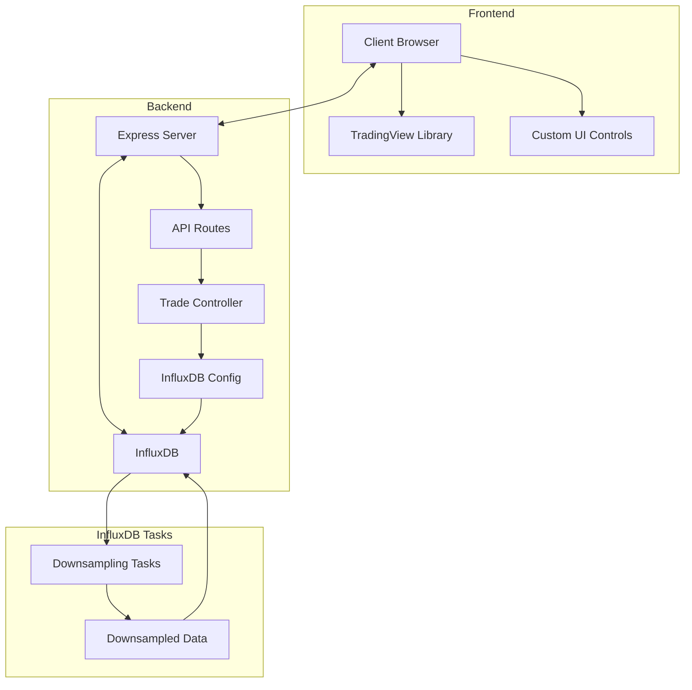
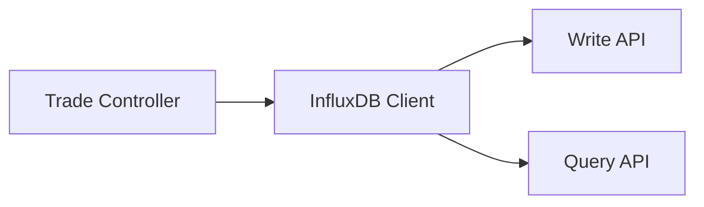
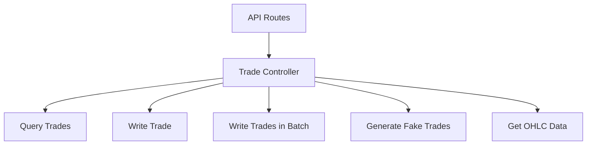
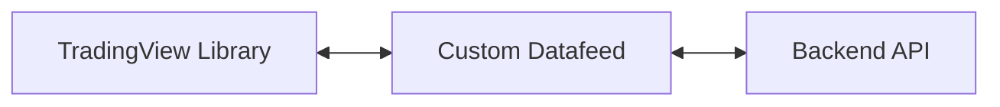
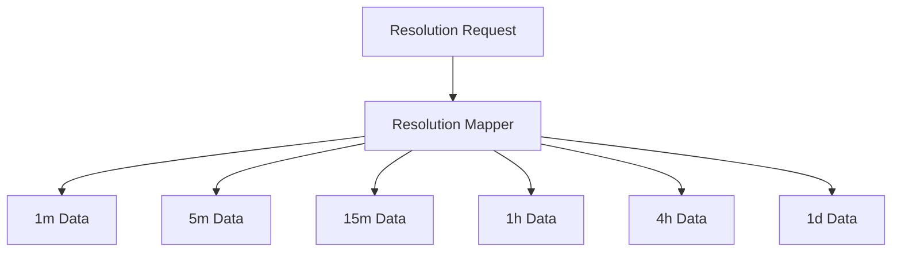
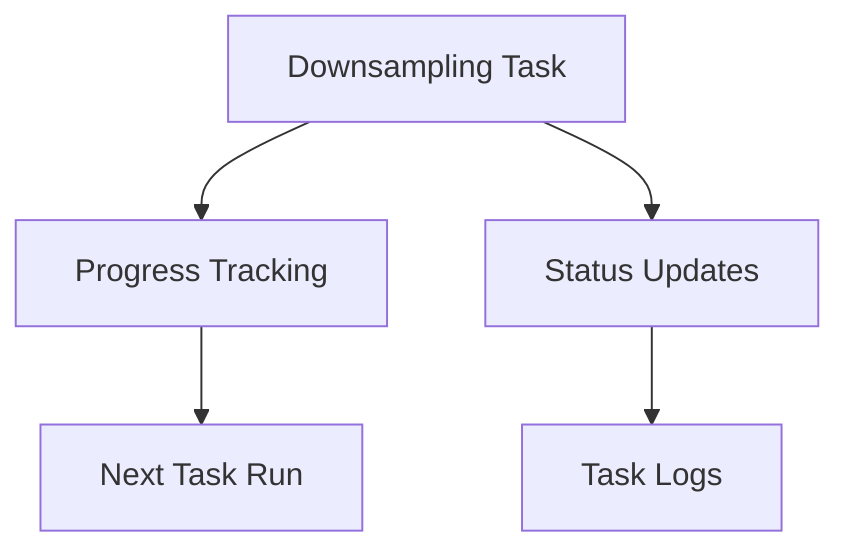
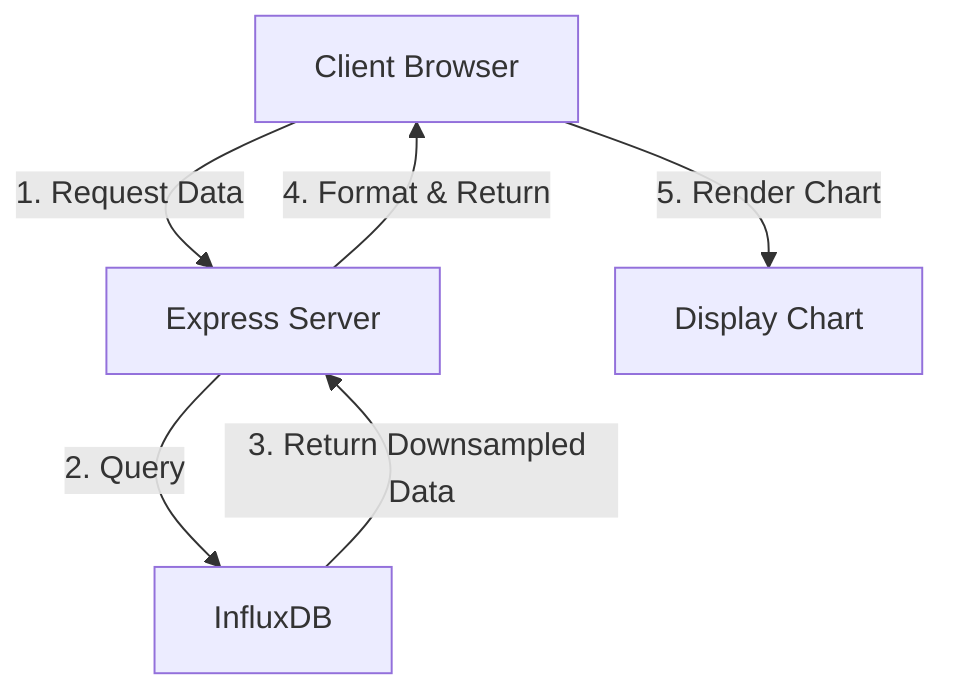
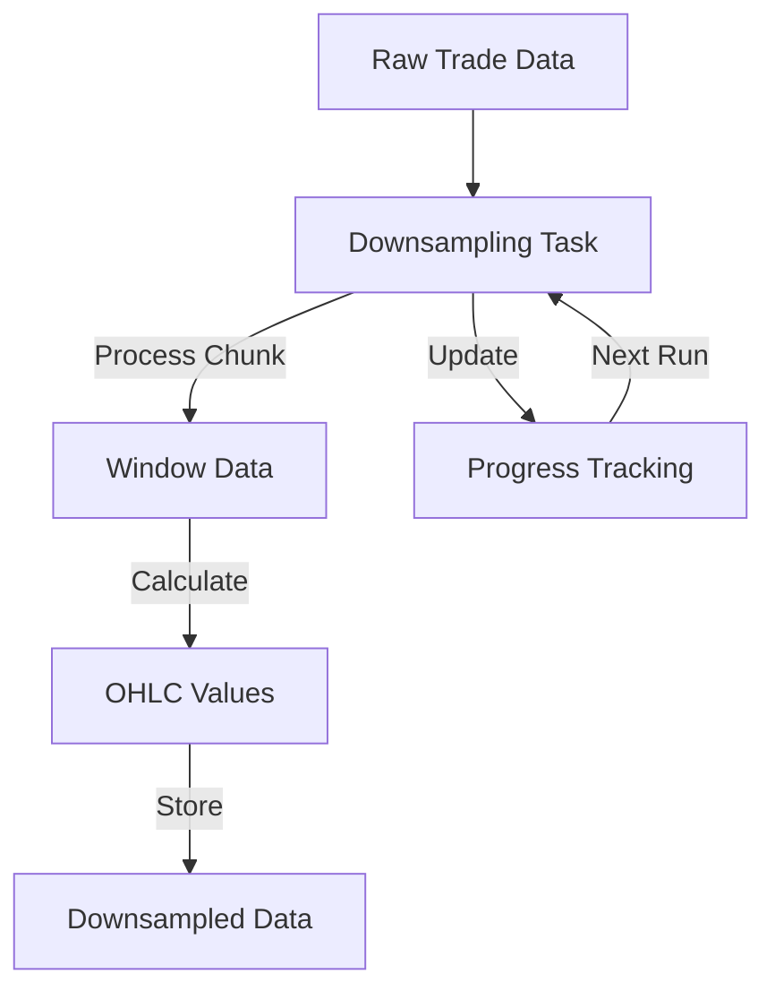

# System Patterns: TradingView InfluxDB POC

## System Architecture

The TradingView InfluxDB POC follows a modern web application architecture with clear separation of concerns:



### Key Components

1. **Frontend**:
   - TradingView Charting Library for visualization
   - Custom UI controls for symbol selection, timeframe selection, and date range picking
   - Custom datafeed implementation to connect TradingView with backend API

2. **Backend**:
   - Express.js server handling HTTP requests
   - API routes for data access and management
   - Trade controller implementing business logic
   - InfluxDB configuration and connection management

3. **Database**:
   - InfluxDB for time-series data storage
   - Raw trade data stored in the main bucket
   - Downsampled OHLC data stored in the same bucket with different measurement names
   - Task status tracking in a separate bucket

4. **InfluxDB Tasks**:
   - Automated tasks for downsampling data
   - Incremental processing with progress tracking
   - Multiple resolution support (1m, 5m, 15m, 1h, 4h, 1d)

## Design Patterns

### 1. Repository Pattern

The application uses a simplified repository pattern to abstract database operations:



- **InfluxDB Client**: Central point for database connection
- **Write API**: Handles data writing operations with retry mechanisms
- **Query API**: Manages data retrieval operations

### 2. Facade Pattern

The trade controller acts as a facade, providing a simplified interface to the complex subsystems:



### 3. Adapter Pattern

The custom datafeed implementation acts as an adapter between TradingView's expected interface and the backend API:



### 4. Strategy Pattern

The resolution mapping strategy allows the system to select the appropriate downsampled data based on the requested resolution:



### 5. Observer Pattern

The downsampling tasks implement a form of the observer pattern to track and report progress:



## Component Relationships

### Data Flow



### Downsampling Process



## Key Technical Decisions

### 1. Incremental Processing with Chunk-Based Approach

The system processes data in time-based chunks to manage memory usage and ensure reliable processing:

- **1m resolution**: Processes 1-day chunks
- **5m resolution**: Processes 3-day chunks
- **15m resolution**: Processes 7-day chunks
- **1h resolution**: Processes 14-day chunks
- **4h resolution**: Processes 30-day chunks
- **1d resolution**: Processes 90-day chunks

This approach allows for efficient processing of large datasets without overwhelming system resources.

### 2. Task Status Tracking

Each downsampling task maintains its status in a dedicated bucket to prevent overlapping runs:

- **Running**: Task is currently processing data
- **Completed**: Task has finished processing its current chunk

This ensures that tasks don't interfere with each other and can safely resume after interruptions.

### 3. Resolution Mapping

The system maps user-requested resolutions to available downsampled data to optimize storage while providing accurate visualization:

```
'1' -> '1m'
'5' -> '5m'
'15' -> '15m'
'30' -> '15m' (Use 15m for 30m requests)
'60' -> '1h'
'120' -> '1h' (Use 1h for 2h requests)
'240' -> '4h'
'360' -> '4h' (Use 4h for 6h requests)
'720' -> '4h' (Use 4h for 12h requests)
'D' -> '1d'
```

### 4. Adaptive Resolution Selection

For very large date ranges, the system automatically selects a larger resolution to improve performance:

- Date range > 365 days: Force 1d resolution
- Date range > 90 days: Force 1h resolution for smaller requests
- Date range > 30 days: Force 15m resolution for 1m requests

### 5. Batch Processing for Data Generation

When generating fake trades, the system uses a batch-based approach with a generator function to avoid storing large arrays in memory:

- Process in configurable batch sizes (default: 100,000 trades)
- Use generator functions to create trades on-demand
- Implement realistic price movement using random walk algorithm

## Error Handling and Resilience

1. **Retry Mechanisms**: InfluxDB client configured with retry options for transient failures
2. **Fallback Strategies**: OHLC queries attempt larger resolutions if the initial query fails
3. **Timeout Handling**: Queries have timeout limits to prevent hanging operations
4. **Task Overlap Prevention**: Tasks check if they're already running before starting
5. **Memory Management**: Batch processing and stream responses for large datasets
